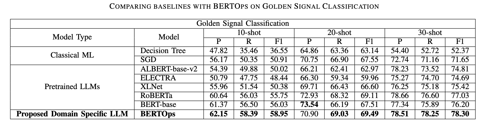
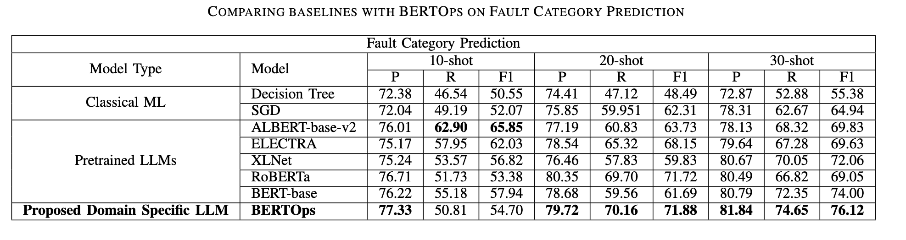
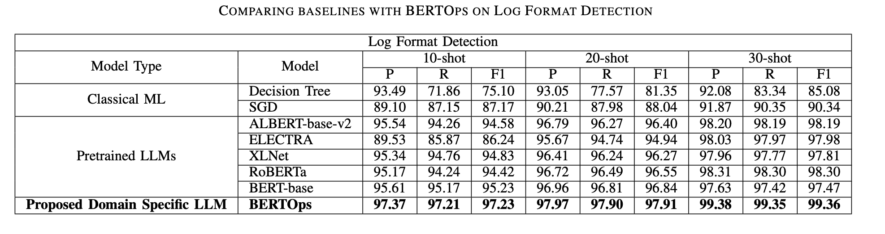

# Learning Representations on Logs for AIOps


## Dataset Distribution

Note: Percentage split of public vs proprietary dataset is about 0.937 % in both training and validation dataset. Below are the dataset distribution for each log source used for training BERTOps.

### Proprietary Dataset

| **Log Source** | **#Train**  | **#Validation** | **#Total**  |
|----------------|-------------|-----------------|-------------|
| Haproxy        | 5000        | 1250            | 6250        |
| MongoDB        | 120,000     | 30,000          | 150,000     |
| Apache         | 165,185     | 41,297          | 206,482     |
| Sockshop       | 86,972      | 21,743          | 108,715     |
| Robotshop      | 17,280      | 4320            | 21,600      |
| **TOTAL**      | **394,437** | **98,610**      | **493,047** |

### Public Dataset

Link to dataset: [https://zenodo.org/record/3227177#.Y5dpGi8RqJ9](https://zenodo.org/record/3227177#.Y5dpGi8RqJ9)

| **Log Source** | **#Train**     | **#Validation** | **#Total**     |
|----------------|----------------|-----------------|----------------|
| Proxifier      | 17,063         | 4266            | 21,329         |
| Linux          | 34,542         | 8636            | 43,178         |
| Zookeeper      | 59,504         | 14,876          | 74,380         |
| Thunderbird    | 80,000         | 20,000          | 100,000        |
| Mac            | 93,826         | 23,457          | 117,283        |
| OpenStack      | 166,255        | 41,564          | 207,819        |
| HPC            | 346,792        | 86,698          | 433,490        |
| Android        | 1,244,004      | 311,001         | 1,555,005      |
| BGL            | 3,798,370      | 949,593         | 4,747,963      |
| HDFS           | 8,940,503      | 2,235,126       | 11,175,629     |
| Spark          | 26,902,298     | 6,725,575       | 33,627,873     |
| **TOTAL**      | **41,683,157** | **10,420,792**  | **52,103,949** |

## Annotated Datasets

Annotated Datasets have been pushed in the `data/` folder. 
**NOTE: The datasets provided contain log lines only from public available log formats from loghub. We have excluded logs from proprietary sources.**


## Results

We present here the results in terms of precision, recall and f1-score. Please check the `results/` folder.






## Reproducing the results

1. Pretraining - We use the pretraining script `run_mlm.py` from huggingface for building the foundation model. [Link](https://github.com/huggingface/transformers/blob/main/examples/pytorch/language-modeling/run_mlm.py)

```bash
python -m torch.distributed.launch \
      --nproc_per_node 4 run_mlm.py \
      --model_name_or_path bert-base-uncased \
      --train_file train.txt \
      --per_device_train_batch_size 64 \
      --num_train_epochs 10 \
      --do_train \
      --output_dir OUTPUT_DIR \
      --max_seq_length 512 \
      --cache_dir OUTPUT_DIR/cache \
      --save_strategy steps \
      --save_steps 5000 \
      --save_total_limit 100 \
      --logging_strategy steps \
      --logging_steps 1000 \
      --line_by_line \
      --report_to none \
      --ddp_find_unused_parameters False \
      --evaluation_strategy no \
      --eval_accumulation_steps 256 \
      --dataloader_num_workers 4 
```

2. FineTuning - We use simpletransformers library for finetuning our model on the three downstream tasks. [Link](https://simpletransformers.ai/docs/multi-class-classification/). 

## Citation

Paper Link: [https://arxiv.org/abs/2308.11526](https://arxiv.org/abs/2308.11526)

```
@misc{gupta2023learning,
      title={Learning Representations on Logs for AIOps}, 
      author={Pranjal Gupta and Harshit Kumar and Debanjana Kar and Karan Bhukar and Pooja Aggarwal and Prateeti Mohapatra},
      year={2023},
      eprint={2308.11526},
      archivePrefix={arXiv},
      primaryClass={cs.CL}
}
```